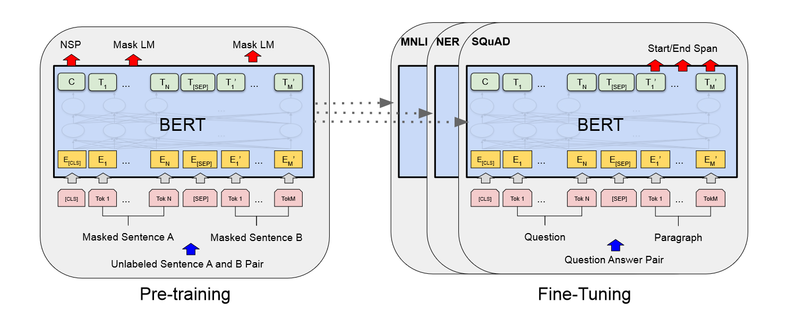

# How did transformers come about? A look at BERT and its capabilities. Use a RAG (BERT + BART) model for question answering.

###### GROUP 2: Alvin Ng Yong Han, Ong Zhi Xuan, Cerise Choon Lee Yoong, Mohammad Hanafi Bin Md Haffidz

## Article Summary
The intent of this article is to explain the key innovations in the field of Natural Language Processing/Understanding to understand the current landscape in SOTA language models available today, and how we got here. We will cover core concepts behind transformer models, such as ChatGPT and BERT. We will also illustrate a specific use case for question answering and how to do this using pre-trained Retrieval-Augmented Generation models (a combination of BERT + BART models).

# History of NLP and key advancements that led to transformer models of today
NLP has been around for a long time, since the 1950s, and has improved significantly over the years. It has become more sophisticated and practical with new technology and methods. In this section, we will talk about the history of NLP and look at some of the most significant improvements made along the way.

The history of Natural Language Processing (NLP) can be broadly categorised into three eras: rules-based, statistical, and neural-based. Here is a brief overview of each Era with some examples:

## Rules-based Era (1950s-1980s)
During this Era, NLP primarily focused on creating rule-based systems that relied on predefined rules to analyse and generate language. Examples of rules-based NLP systems include ELIZA, a chatbot developed in the 1960s that used pattern-matching rules to simulate conversation with humans. These rules were created by linguists and experts in language and were used to identify parts of speech, sentence structure, and other linguistic features.

The main advantage of rules-based systems is their interpretability and explainability. Since the rules are predefined and transparent, it is easy to understand how the system works and how it generates language. However, the main limitation is their need for more flexibility and adaptability. Moreover, these systems can only handle language within the scope of their predefined rules, which limits their ability to understand and generate natural language.

## Statistical Era (1980s-2010s)
In the statistical era, NLP shifted towards statistical methods, which relied on large amounts of data to generate language. These methods used statistical models to learn from data and identify language patterns, allowing them to create more natural-sounding language.

One example of a statistical NLP system is the Hidden Markov Model (HMM), used in speech recognition to identify the most likely sequence of words based on the input audio signal. Another example is the n-gram language model, which uses the probability of a sequence of words to predict the next word in a sentence.

The main advantage of statistical methods is their ability to learn from data and improve over time. However, their main limitation is their reliance on large amounts of data. The quality and quantity of data can hinder their ability to generate natural language.

## Neural-based Era (2010s-Present)
The neural-based Era of NLP relies on deep learning algorithms and neural networks to process and understand language. These methods are inspired by how the human brain processes language and can better handle complex and ambiguous language structures.

One example of a neural-based NLP system is the transformer model, which was introduced in 2017 and has revolutionised the field of NLP. This model uses self-attention mechanisms to process long text sequences and has been used in various applications, including language translation and text summarisation.

The main advantage of neural-based methods is their ability to handle more complex and ambiguous language structures while improving interpretability and explainability. For example, attention mechanisms, which are used in many neural-based models, can help identify which parts of the input text are most relevant for generating a given output. Additionally, interpretability techniques such as LIME (Local Interpretable Model-Agnostic Explanations) and SHAP (SHapley Additive exPlanations) can help explain the decision-making process of neural-based models. However, these methods still need to be improved by their reliance on large amounts of data, and their complexity can make them challenging to train and interpret.

# Key Advances during the Neural-based Era
## From context-free to contextual representations
**Bag-of-Words (BOW) Embeddings (e.g. CountVectorizer, TF-IDF)**
BOW embeddings represent a document or sentence as a bag of individual words, where each word is represented as a vector in a high-dimensional space. These embeddings are context-free because they do not take into account the surrounding words or the order in which they appear.
- Statistical method, used in classification, where there may be different word distributions between classes.
- Word representations don’t inherently capture any representation/meaning/embedding, this is not much different from simply one hot  encoding.

**Word Embeddings (e.g. Word2Vec, GloVe)**
Word embeddings are similar to BOW embeddings, but they represent each word as a dense vector in a lower-dimensional space, such that similar words have similar vector representations. Word embeddings are also context-free because they do not capture the meaning of a word in different contexts.
- In this vector space, we can see there are relationships captured. The difference in distance and direction between ‘man’ and ‘woman’ are similar to that of ‘king’ and ‘queen’. In fact, in this representation, it  was shown that  if you did math on the embeddings, ‘king’ - ‘man’ + ‘woman’ ~ ‘queen’. The match was not 100%, but ‘queen’ was the closest entity in that  vector space after that  operation.
- This is a big step up from before! However, the embeddings do not capture context. As much of language depends on additional context given by the words surrounding a word in question, there are many instances where this fails. For example, ‘bank’ could mean a financial institution or the ground alongside a river. In the above pre-trained Word2Vec embeddings, some words which may have  multiple meanings such as the above, might have their meanings either muddled, as the model may have been trained on data that  saw both meanings, or only managed to capture one of those meanings because it  was more dominant/present in the train data.

**Contextualized Word Embeddings (e.g. ELMo, GPT, BERT)**
Contextualized word embeddings (such as ELMo, GPT, and BERT) are generated by training deep neural networks on large amounts of text data, taking into account the context in which each word appears. These embeddings are contextual because they capture the meaning of a word in different contexts, allowing for more accurate natural language understanding.
- For example, BERT is trained by masking out random words in a given sentence, and trained to predict the missing word given the words surrounding it. As such, the embeddings it learns is able  to pick up on the  context of a given word, given its surrounding words.

## From single words to sequences
Initially, NLP models focused on the analysis of individual words, such as the bag-of-words model, which represents a document or sentence as a collection of individual words. However, this approach ignores the order in which the words appear and the dependencies between them.
- "Quite bad, not good." vs "Quite good, not bad." would appear to mean the same thing.

To address this limitation, NLP moved towards the use of n-grams, which represent a document or sentence as a collection of contiguous sequences of n words. This allowed for some capture of word order and dependencies, but the approach was limited by the fixed window size of the n-grams.
- In the above example, setting an ngram of up to 2 words, we would have the following tokens for the first sentence:
 - Quite, bad, not, good, quite bad, bad not, not good.
- Thus it is able to retain some informative word order, but limited to the size of the ngram window.

The next step in this evolution was the development of recurrent neural networks (RNNs), which could process sequences of words of variable length. RNNs can model the dependencies between words in a sequence by passing information from one time step to the next. However, RNNs are limited in their ability to capture long-term dependencies due to the vanishing gradient problem.
- Essentially, a unidirectional RNN is able to recall some recent past words it has read in. Thus it is able to capture the context of words that may be several words apart.
- However, it is only able to ‘look back’ and contextualize current words based on recent past words it has seen, but not ‘look ahead’. To address this, some models employed bi-directional RNNs i.e 2 RNNs one fed the forward order of tokens, one the reverse, so that they could incorporate the ‘look ahead’ ability as well.

To address the ‘short memory’ limitation, long short-term memory (LSTM) networks were developed, which are a variant of RNNs that can better capture long-term dependencies. LSTMs use a gating mechanism to selectively retain and forget information over time.
More recently, attention mechanisms and transformers have been developed, which allow for the capture of dependencies between different parts of the input text. Attention mechanisms allow the model to focus on specific parts of the input text, while transformers are able to process entire sequences of words in parallel, making them much more efficient than RNNs.

Contextualized word embeddings, such as ELMo, GPT, and BERT, have also played a significant role in the shift from words to sequences. These embeddings capture the meaning of a word in different contexts, allowing for more accurate natural language understanding.

Overall, the shift from words to sequences in NLP has been a gradual process, driven by the development of increasingly sophisticated models and techniques, including n-grams, RNNs, LSTMs, attention mechanisms, transformers, and contextualised word embeddings. These models have enabled NLP to handle more complex language tasks, such as language translation, sentiment analysis, and question answering.

Next, we will take a closer look at transformer model architectures and how they work.

# Before transformers
## Statistical Machine Translation
Prior to neural networks, **Statistical Machine Translation** systems were the dominant form of machine language translation systems employed. They required a lot of rule based programming that was complicated; the best systems were extremely complex, required lots of feature engineering to capture particular language phenomena (e.g. tables of equivalent phrases) and took significant effort to maintain, and this effort had to be repeated for each language pair you wished to translate.

## Neural Machine Translation
**Neural Machine Translation** (Seq2seq RNNs) came about in 2015, and these involved 2 RNNS (encoder and decoder) to learn the embeddings of the source input sentence and the decoder to produce the output sentence. Much less human effort required programmatically, just have labelled data i.e source and target texts (albeit you need a large corpus), and NMT will automatically learn embeddings and optimize itself end-to-end. Seq2seq is also versatile and useful for text summarization and code generation.

The results were more fluent, better context, better phrase similarities as compared to SMTs. But the cons were they were black box models, difficult to control or debug when something goes wrong. For example, it could model the biases that exist in the texts, and infer that nurses were female and programmers were male when the source language did not specify this.

Other problems still remain, such as out-of-vocab words, domain mismatch between train data and real world use cases resulted in poor performance, RNNs still had trouble maintaining context over longer texts, and being neural networks, required significant data, so they did not work well for low resource language pairs. Some spurious examples of this were an example of Somali 'ag ag ag ag ag' where a user would input garbage text, and it would convert to "As the name of the Lord was written in the Hebrew language..." in English. This was due to a bias where often in low resource languages, a common text that would be translated was the Bible, and given nonsensical inputs, the decoder had the tendency to produce the highest probabilistic words, which ended up being texts from the Bible.

## Attention
The attention mechanism was introduced as a way to solve the information bottleneck of 'reducing' passing though the last time step on the encoder to the decoder.

Whilst theoretically an RNN could access all past time steps, practically, there was a tendency of vanishing gradients and therefore only the most recent few time steps would be captured in the last time step encoding. Thus an RNN could not retain long term contextual dependencies. The attention mechanism solves this, as on each time step of the decoder, it can access directly a particular time step on the encoder, to focus on a particular word. Coming from statistical machine learning where alignment was hard alignment and had to be hand-coded manually, we now have soft alignment, and it is learned automatically.

# Transformers & Self-Attention
Although attention solved the information bottleneck, regardless, RNN as an architecture still had shortcomings.
It was sequential, meaning you had to compute steps in a sequence as the output of each one fed to the next. This meant you could not easily parallelize training and make use of parallelization on GPUs. 
Thus the next natural step was to get rid of RNNs altogether. Self attention captures contextual relationships between tokenized words in the encoder itself, whereas earlier attention was used by the decoder to refer to specific time steps in the encoder. And by not representing a sentence's word positioning through another feature as opposed to structurally feeding it recurrently, this allowed computation to be parallelizable, allowing for much faster training, and also even more long term contextual dependencies to be captured.

## What is BERT?
BERT, (Bidirectional Encoder Representations from Transformers), is a pre-trained language model that uses a deep neural network architecture called Transformers to understand natural language text. It was developed by Google in 2018 and has since become a popular tool in natural language processing (NLP) tasks.

The BERT model uses a transformer architecture, which is a type of neural network that allows for bidirectional processing of input data. This means that the model is able to consider the context of a word by looking at the words that come before and after it. This is in contrast to previous language models, which only looked at the words that came before the current word (i.e. left-to-right processing).

### How is it able to do this has to do with how it was trained:
The pre-training process for BERT involves two main stages. The first stage is called masked language modeling, in which the model is trained to predict a missing word in a sentence. The model is presented with a sentence with a randomly masked word, and it must predict the missing word based on the context of the sentence. This process helps the model learn to understand the relationships between different words in a sentence.

The second stage of pre-training is called next sentence prediction. In this stage, the model is trained to predict whether two sentences follow each other logically or not. This helps the model learn to understand the relationships between sentences in a larger piece of text.

### BERT Architecture
The architecture of BERT consists of two main components: the encoder and the pre-training objectives.

- Encoder: BERT uses a multi-layer bidirectional Transformer encoder, which takes a sequence of input tokens and outputs a sequence of contextualized embeddings for each token. The Transformer encoder is composed of a stack of identical layers, each with a self-attention mechanism and a feedforward neural network.

- Pre-training objectives: BERT is pre-trained using two objectives: masked language modeling (MLM) and next sentence prediction (NSP).

 - Masked language modeling (MLM): A certain percentage of the input tokens are randomly masked during pre-training, and the objective is to predict the original token based on the surrounding context. This forces the model to learn context-dependent representations of words. *"BERT is designed to pre-train deep bidirectional representations from unlabeled text by jointly conditioning on both left and right context in all layers. As a result, the pre-trained BERT model can be fine-tuned with just one additional output layer to create state-of-the-art models for a wide range of tasks, such as question answering and language inference, without substantial task-specific architecture modifications."*

 - Next sentence prediction (NSP): The objective is to predict whether two input sentences are consecutive or not. This helps the model learn the relationships between different sentences in a document.

*Overall pre-training and fine-tuning procedures for BERT. Apart from output layers, the same architectures are used in both pre-training and fine-tuning. The same pre-trained model parameters are used to initialize models for different down-stream tasks. During fine-tuning, all parameters are fine-tuned. [CLS] is a special
symbol added in front of every input example, and [SEP] is a special separator token (e.g. separating questions/answers)*

Once the model is trained, it can be fine-tuned for specific NLP tasks such as sentiment analysis, named entity recognition, question-answering, and others. Fine-tuning involves adding additional layers to the pre-trained model and training it on a specific dataset for a particular task.

One key advantage of BERT is that it is a pre-trained model, which means it can be fine-tuned on a new task with relatively little labeled data, making it highly efficient and effective. Additionally, the bidirectional nature of the model allows it to capture the context of each word in a sentence, which is important for many NLP tasks.

### What tasks can a BERT model perform?
BERT, being a pre-trained language model, can be fine-tuned on a variety of natural language processing (NLP) tasks. Here are some of the tasks that BERT can perform:

- **Text Classification**: BERT can be used for binary or multi-class text classification tasks such as sentiment analysis, spam detection, and topic classification.
- **Named Entity Recognition (NER)**: BERT can identify and extract entities such as people, organizations, locations, and products from text.
- **Question Answering**: BERT can answer questions based on a given passage of text by understanding the relationships between the words in the passage.
- **Language Translation**: BERT can be fine-tuned for machine translation tasks, which involves translating text from one language to another.
- **Text Summarization**: BERT can be used to summarize a large piece of text into a shorter, more concise version.
- **Natural Language Inference (NLI)**: BERT can determine whether a given statement is true, false, or unknown based on a given premise.
- **Conversational AI**: BERT can be used to develop chatbots and other conversational AI applications by understanding the intent of a user's input and generating a response.

## GPT (Generative Pre-Trained Transformer)
The intent and design principle for GPT was for it to be able to generate human-like text in a variety of contexts without requiring further fine-tuning.
It is important to note that GPT has significantly more parameters and computational power than BERT, which may make it more suitable for certain types of NLP tasks.

GPT is trained to predict the next word in a sequence unidirectional model, meaning it can only look at the preceding words in a sequence (whereas BERT is bidirectional).
It uses an "autoregressive language modeling" objective to pre-train a multi-layer unidirectional transformer decoder.

### Applications of GPT include:
- Text Generation
- Chatbots
- Language Translation
- Content Creation
- Personalization
- Voice Assistants
- Sentiment Analysis
- Text Summarization
- Search Engines
 
## BERT vs GPT
BERT excels at tasks that require understanding the relationship between different parts of a sentence, such as question-answering and text classification
- (Where GPT’s unidirectional architecture is its weakness)
  
GPT is often used for tasks that require generating text, such as language translation and text completion.
- (Where BERT’s bidirectional architecture does not fit this role)

### BART (Bidirectional and Auto-regressive Transformer)
Before we get into the RAG model, let me explain what the BART model is:

Loosely speaking, it is sort of BERT + GPT combined. BART combines both auto-regressive and denoising auto-encoding pre-training objectives. Denoising auto-encoding means it was trained to reconstruct a corrupted version of the input sequence. This allows it to be suited for:
- Text generation
- Question Answering
- Summarization
- Translation
- Classification

Some key differences between BART and BERT or GPT is that 
- BART is designed for both auto-regressive and non-autoregressive tasks. 
- BART can do bidirectional generation, so excels at as summarization.
- BART uses a denoising auto-encoding training objective, which involves corrupting the input sequence and training the model to reconstruct the original sequence. This helps BART to learn more robust representations of the input sequence, which can be beneficial for tasks such as text generation.

## RAG (Retrieval-Augmented Generation) model
For our question answering use case below, we are utilising the RAG model, which was developed by researchers at Meta AI in 2020, to improve on knowledge intensive tasks, a problem where LLMs such as GPT still tend to lag behind on. (https://arxiv.org/abs/2005.11401)

The RAG model consists of three main components: a retriever, a reader, and a generator. 

- **Retriever**: The Dense Passage Retriever component uses a dense retrieval algorithm to retrieve a set of relevant passages from a large text corpus. The retriever is pre-trained on a large corpus of text to learn to retrieve relevant passages based on a given query.

 - In the DPR model, BERT is used to encode both the query and the passages into dense vector representations. The encoder part of the BERT model is fine-tuned on a large corpus of text to generate high-quality vector representations of words and sentences. The DPR model then uses these vector representations to compute the similarity between the query and the passages, and retrieves the most relevant passages for a given query.

 - The use of BERT as the pre-trained model in the DPR model allows it to capture the semantic meaning of the text and encode it into dense vector representations. This enables the DPR model to retrieve relevant passages that match the semantic meaning of the query, even if they use different words or sentence structures.

 - Overall, the combination of BERT and the dense retrieval algorithm in the DPR model allows the RAG model to achieve state-of-the-art performance on question answering tasks, by efficiently retrieving relevant passages from a large corpus and generating high-quality answers based on the retrieved information.

- **Reader**: The reader component is responsible for understanding the retrieved passages and generating a representation of their content. The reader uses a transformer-based architecture and is fine-tuned on a specific question answering task.
- **Generator**: The generator component takes the output of the reader and generates a final answer to the given query. The generator uses a BART model that is trained using maximum likelihood estimation to generate the answer.

The RAG model combines the strengths of both retrieval-based and generation-based approaches to question answering. The retriever is able to quickly narrow down the search space and retrieve relevant passages, while the reader and generator are able to generate high-quality answers based on the retrieved information. Overall, the RAG model is a powerful approach to question answering that combines the strengths of both retrieval-based and generation-based approaches.

### Transfer Learning in NLP

Transfer learning is a technique used in natural language processing (NLP) to improve the performance of models on new tasks. It involves using a pre-trained model as a starting point to build a model for a new task, rather than training a new model from scratch. There are three types of transfer learning used in NLP: fine-tuning, feature-based, and model-based transfer learning. Fine-tuning involves using a pre-trained model as a starting point and training it on the new task with the goal of adapting it to the new task. Feature-based transfer learning involves using a pre-trained model to extract features, which are then fed into a separate model trained on the new task. Model-based transfer learning involves using a pre-trained model as the starting point for a new model, which is then fine-tuned on the new task.

Two popular transfer learning techniques in NLP are pre-training and language modeling. Pre-training involves training a model on large amounts of data, often using a self-supervised approach, to learn general features of language that can then be fine-tuned on a specific task. Language modeling involves training a model to predict the probability of a word given its context, which can then be used as a feature for downstream NLP tasks.

Using transfer learning in NLP has several benefits, including improved accuracy and reduced training time. Transfer learning has been demonstrated to outperform traditional approaches on a variety of NLP tasks, such as sentiment analysis, question answering, and text classification.

However, there are also limitations to transfer learning in NLP. One of the main limitations is the need for large amounts of data for pre-training and fine-tuning, which can be a challenge for low-resource languages or domains. Additionally, pre-trained models may introduce biases that can affect downstream tasks, and it can be difficult to detect and address these biases.

In conclusion, transfer learning is a powerful technique for improving the performance of NLP models on new tasks. By leveraging pre-trained models and general language features, transfer learning can significantly reduce the time and resources needed to develop accurate NLP models. However, it is important to be aware of the limitation and potential biases of pre-trained models, and to carefully consider the data and methods used in pre-training and fine-tuning.

# Sources
- https://ai.googleblog.com/2018/11/open-sourcing-bert-state-of-art-pre.html
- https://arxiv.org/abs/1810.04805
- https://arxiv.org/abs/2005.11401
- https://arxiv.org/abs/1910.13461
